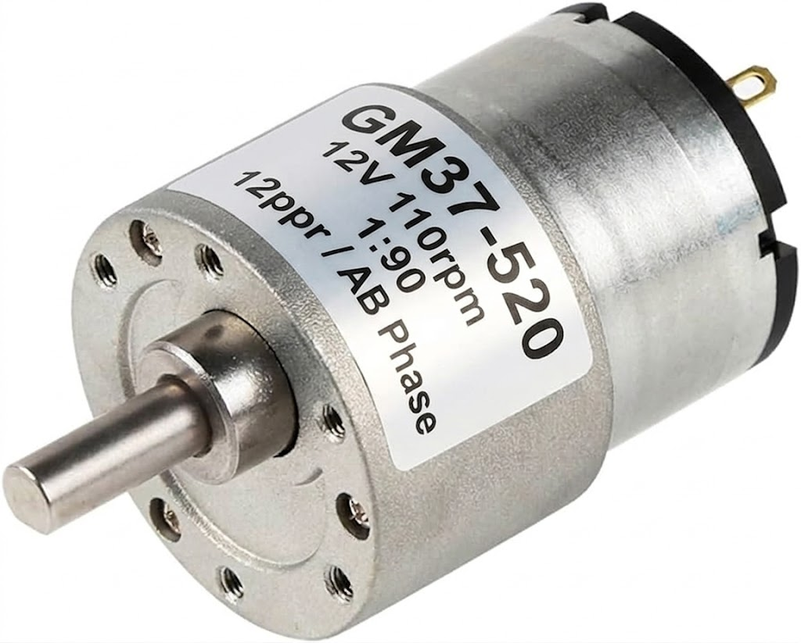

# Modelado Matemático: Especificaciones del Motor y Resolución Espacial

Para traducir una orden de software (ej. "Avanza 50 cm") en movimientos físicos reales, construimos un modelo matemático vinculando las especificaciones electromecánicas del motor GM37-520 con la geometría de la llanta Mecanum.

A continuación, se detalla la caracterización teórica y aplicada:

## A. Análisis de la Transmisión Electromecánica (Motor GM37-520)

La placa de características del motor nos proporcionó tres variables fundamentales que definen el rendimiento del chasis:



1. 12 PPR (Fase AB): El encoder magnético de cuadratura acoplado al eje interno del motor genera 12 pulsos eléctricos por cada revolución completa de dicho eje (antes de pasar por los engranajes).

2. Relación de Reducción (1:90): La caja reductora metálica exige que el motor interno gire exactamente 90 veces para que el eje de salida (donde va la llanta) complete una sola vuelta.

3. 110 RPM (a 12V): La velocidad máxima teórica del eje de salida sin carga.

**Cálculo de Resolución del Encoder (Pulsos por Vuelta):**

Para saber cuántos pulsos lee nuestro microcontrolador por cada giro completo de la llanta, multiplicamos la resolución base por la caja reductora:

Pulsos Totales = 12 PPR x 90(Reducción) = 1080 pulsos por vuelta.

Este valor teórico de 1080 fue validado empíricamente en laboratorio usando lectura manual, obteniendo un margen de error mecánico por backlash inferior al 0.4%.

## B. Análisis Geométrico (La Rueda Mecanum)

Para llevar los pulsos al mundo real, necesitamos la distancia física que recorre la rueda en un giro completo.

**Diámetro Medido:** Inicialmente se midió un diámetro de 5.7 cm. Sin embargo, mediante pruebas de lazo cerrado (desplazamiento de 50 cm con sobretiro de 2.5 cm), se calibró el modelo deduciendo que el diámetro efectivo de rodadura del chasis ensamblado corresponde al estándar de 6.0 cm.

**Cálculo de la Circunferencia ($C$):** 
Utilizando el diámetro calibrado, calculamos el perímetro de la llanta:

C = π x D
C = 3.1416 x 6.0  cm = 18.85 cm
(Esto indica que por cada revolución completa, el chasis se desplaza linealmente 18.85 cm).

## C. La Ecuación de Odometría (El "Número Mágico")

Conociendo los pulsos por vuelta y los centímetros por vuelta, establecimos la Resolución Lineal del robot, es decir, cuántos pulsos equivalen a 1 centímetro en el piso.

**Resolución lineal** = Pulsos Totales/C

**Resolución lineal** = 1080/18.85 = **57.3 pulsos/cm**

**Implementación en el Software:**
Gracias a este modelo, abstrajimos la complejidad matemática en el código. El sistema de navegación autónoma funciona multiplicando cualquier distancia solicitada por esta constante:

```
float distancia_cm_objetivo = 50.0; 
float pulsos_por_cm = 57.3; 
int32_t meta_pulsos = (int32_t)(distancia_cm_objetivo * pulsos_por_cm);
```
Con este modelo, si solicitamos 50 cm, el algoritmo de control calcula dinámicamente un objetivo de 2865 pulsos, garantizando un posicionamiento milimétrico.
