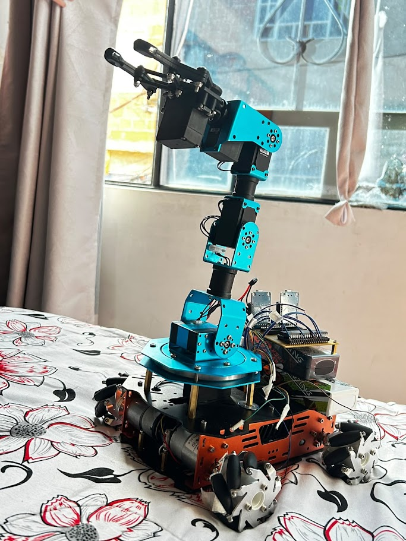

# Proyecto Semillero: Primera Parte-Jaider Esteban Medina Rubio

Este repositorio documenta el progreso, simulaciones de solidworks,código para el desarrollo de un vehículo omnidireccional integrado con un brazo robótico ,ademas de la comunicacion con diferentes elementos de desarrollo.

## 🎯 Meta del Proyecto

Lograr la integración funcional y el control inalámbrico entre un chasis de tracción omnidireccional y un brazo robótico manipulador de 5 DOF. El proyecto se sustenta en una arquitectura de control distribuida y la implementación de un entorno de simulación virtual, garantizando un diseño mecánico optimizado y operaciones precisas.

Para alcanzar esta meta, el sistema se divide en las siguientes características clave:

## Arquitectura de Control Distribuido:

 Control independiente mediante microcontroladores PIC dedicados (uno para la tracción del chasis(Puentes H-Motores GM37-520) y otro para la manipulación del brazo Xarm 1s), comunicados estrictamente mediante protocolo UART, omitiendo el uso directo de señales PWM entre placas.

## Red de Telecomunicaciones (Topología Maestro-Esclavo): 

Implementación de una red de radiofrecuencia mediante módulos XBEE. Un XBEE "Maestro/Jefe" distribuye las órdenes hacia los XBEE receptores ubicados en cada subsistema (Chasis y Brazo (Un XBEE para cada PIC)).

## Interfaz de Usuario y Puente IoT:

 El módulo Maestro XBEE recibe sus instrucciones desde un ESP8266 NodeMCU V3, el cual actúa como puente WiFi. Este recibe los comandos en tiempo real desde una interfaz web desarrollada en Visual Studio Code (utilizando Java/JavaScript).

## Implementación de Gemelo Digital: 

La interfaz web no solo envía comandos, sino que integra y visualiza los modelos URDF del carro y el brazo. Actúa como un Gemelo Digital (Digital Twin) donde los movimientos físicos (rotación de llantas, articulaciones del brazo) solicitados a través de la interfaz se simulan y reflejan de manera sincronizada en el entorno virtual.

